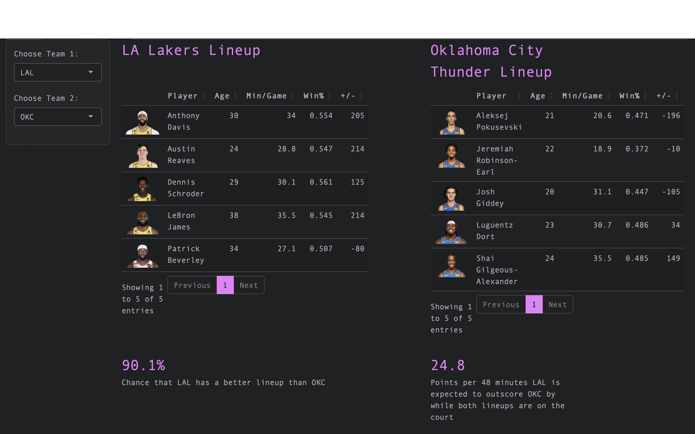

# Project Overview

This Shiny App was designed as a personal project for my portfolio.

## Repository Contents

All of the required files to run the Shiny App are contained within the file 'NBA-Lineup-Analysis-App'.

Files that directly contain results of the project:

* app.R

Files that contain data used within the project file (These files must not be deleted in order for app.R to properly run):

* nba_lineups_five_players.csv

* nba_player_stats.csv

Additional Files (These files do not directly impact app.R):

* get_nba_data.py

## Description of Project

This project seeks to analyze NBA lineup data from the 2022-23 Regular Season. The user has the ability to select two teams and lineups to evaluate how well these lineups would matchup with each other. Although it is not required that the lineups had played each other at some point during the season, it is required that each individual lineup has played at least once during the 2022-23 season.

### App Contents

There are three main components of the Shiny App, available via tabs at the top of the page:

**Matchup Analysis**: The Matchup Analysis section allows the user to select five-player lineups from two different teams to analyze how well the lineups would perform against each other. The lineups, and the corresponsing players' stats, are displayed at the top of the section. The analysis is then broken down into two parts:

* Stronger Lineup Probability: The probability that one lineup is better than the other is calculated and displayed. I define "better" as having a larger probability that one lineup will outscore the other while both lineups are on the court. This calculation is determined by using a binomial distribution of standardized +/- (Plus-Minus) stats.

* Score Differential: How much one lineup is expected to outscore the other in a 48-minute game while both lineups are on the court. This calculation is determined by taking the difference in standardized +/- (Plus-Minus) stats for both teams.

**Individual Player Analysis**: The Individual Player Analysis section allows the user to select a team to display individual player stats. There are two interactive tables displayed on this page:

* Leading Players by Lineup: This table displays stats for players that are members of the most distinct lineups for their team. These stats include:

  * Win%
  * Minutes/Game
  * +/-
  * Number of Lineups Participated In
 
* Player Leaderboard: This table displays stats for all players on the team. The table is interactive, so each stat can be sorted to display the leaders in that stat for the team. These stats include:

  * Points per Game
  * Field Goal %
  * Free Throw %
  * Offensive Rebounds
  * Defensive Rebounds
  * Turnovers
  * Assists
  * Steals
  * Blocks
  * Total Points

**Team Chemistry**: The Team Chemistry section allows the user to select a team and a subsequent lineup of that team to determine that lineup's Team Chemistry Score. The lineup, and the corresponsing players' stats, is in a table displayed at the top of the section. The Chemistry Score can be found the the right of this table.

A Team's Chemistry Score is defined as the difference in the standardized +/- stat for the five-player lineup and the aggregation (sum) of all standardized +/- stats for each player in that lineup. A lineup is considered to have "good team chemistry" if "the whole is greater than the sum of its parts". Therefore, if the lineup's standardized +/- stat is greater than the sum of the individual players' standardized +/- stats, then the difference would be positive, and the lineup would be considered to have "good chemistry". Likewise, if the score is negative, meaning the whole is NOT greater than the sum of its parts, then the lineup has "bad chemistry".

At the bottom of the page is a distribution plot of Team Chemistry Scores for all teams within the dataset (n = 2,000). When a valid lineup is selected, a dashed line will appear on the plot to indicate at what point in the distribution the selected lineup's Team Chemistrry Score fall. A percentile value for the score is also present in the plot.

### Data

This project uses data from regular-season games in the 2022-23 season, for all 30 NBA teams. The data was acquired using the NBA Stats API via Python (see get_nba_data.py). Both individual player statistics and five-player lineup statistics were acquired from the API.

Player headshots were acquired from the NBA, using the link https://akstatic.cms.nba.com/wpcontent/uploads/headshots/nba/latest/260x190/<player nba id>.png using each player's unique NBA player ID.

The data was then cleaned and aggreagated in preparation for usage.

### Methods

Since a raw +/- stat may not be entirely representative of a player/lineups performance (i.e., if a lineup only plays 5 minutes within the entire season and scores 10 points, they will have a very high +/- stat, which may not be representative of that lineup's true ability and talent), all of the +/- stats were adjusted to account for minutes played throughout the season.

## Directions for App Usage

To use the app from the hackathon_app file:

1. Open an New Session in R
2. Set working directory to the NBA-Lineup-Analysis-App file
3. From the NBA-Lineup-Analysis-App file, open `app.R`
4. Click 'Run App'

* If the R session does not have all of the necessary packages to run the app, install the necessary packages within the console

5. In the pop-up window, click 'View in Browser' to open the Shiny App in the user's default browser (the App was designed for browser usage and operates best in this setting)
6. Wait for data to populate page (can take between 10 and 30 seconds)
7. Select Teams inputs on the side of the page
8. For The Matchup Analysis tab and Team Chemistry tab, choose a valid *five* player lineup (Note: if the lineup is not valid, meaning it hasn't played at all in the 2022-23 season, or too many/too few players are selected, the user will be notified via an error message)
9. View resulting analysis within the app

